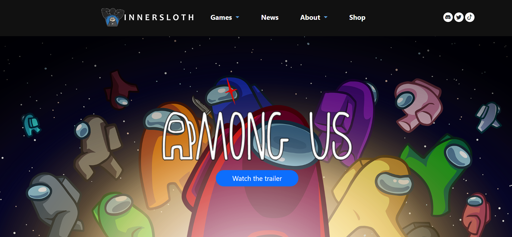

## It isn't always going to be perfect

When it comes to education, I am a perfectionist. I will always aim to get things done efficiently, where it would end with a near-perfect result. So, when I am tasked to do something where I need to be precise, I will try everything to achieve the perfect outcome. Nonetheless, there are times when this isn’t always the case. There are times when it isn’t possible to achieve that result and it doesn’t always need to be perfect. That being said, UI Frameworks was a nightmare for me.

## Frustrations of learning

UI Frameworks and the process of designing and developing it is simple, I thought to myself. I always thought many programs made it easy to make these websites, but I was entirely wrong. Working with UI Frameworks, like HTML and Bootstrap 5, is similar to trying to design something on Google Docs. Where you would want to add a table, or maybe even some images to spice up your paper. However, everyone has experienced the frustration of trying to move that image so that it's in the right place. Spending countless minutes trying to make sure the image doesn’t end up on the next page. This experience was similar to when I was working with HTML, where images would end up being placed nowhere near where I wanted them to be or text was slightly missed aligned by a few pixels. Having to adjust those tiny details, just to get something somewhat similar to the end product I wanted was frustrating. All in all, learning HTML was a hassle that I didn’t need to go through, since there’s something like Bootstrap 5.

## Quality of life change

The transition from HTML to Bootstrap 5 was similar to slimming down a wall of code into just a few lines. Using Bootstrap 5 was a huge quality of life change, where I no longer needed to be super precise with what I had to do. For instance, having a layout of a navigation bar, the main text, and a footer was no longer complicated. These parts were now just a simple outline that came with using Bootstrap. For illustration, I was tasked to replicate a website of my choice. Since most websites follow that similar outline of using a navigation bar and footer, all I had to do was make some adjustments and everything seemed to work out. Overall, using Bootstrap 5 has been quite a pleasant experience and I definitely would recommend it to anyone who is planning to use HTML to create websites.
