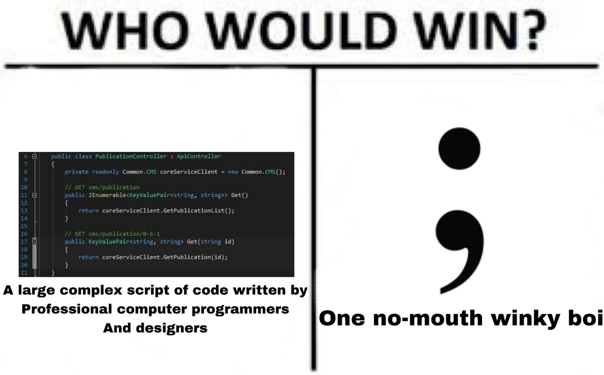

# Coding Standards are Annoying
  When I first started to learn programming, the idea of coding standards never clicked with me. I always thought to myself, why do I have to format my code in a specific style? It annoyed me at first since I would always get errors and warnings even though my code was working perfectly fine. From keeping else statements on the same line as their curly braces to using single quotation marks only, all these warnings made no sense to me. However, over time I realized the importance of these standards. Acknowledging the fact that it isn’t just an excessive format to follow, but a tool that makes programming more understandable.

  Coding standards are no different from the way you format your essays, the traditional 12pt font, Times New Roman, and double-spaced. Arrange your essay by breaking up your information into paragraphs and adding headers. You could write an essay in Comic Sans and just have a wall of text, but there's an issue with this. Even though both essays have the same information, one is confusing and hard to look at. Having a specific format for essays so that is understandable and easy to follow applies to coding as well. Formatting your code to a specific style allows not only you but other people looking at your code to understand. It made me realize how important it was to keep those else statements on the same line as their curly braces.

# Coding Standards are Anoying but Helpful

  As I begin learning how to properly use Intellij, I can see myself enjoying the process of understanding it. IntelliJ is a lot more refined and polished than most IDEs that I’ve used in the past. It has more built-in functionalities, like having easy access to GitHub. However, the one thing that I was required to have for my ICS 314 class was ESLint, a programming tool that helps with basic coding standards. It was annoying at first since it forced me to get accustomed to a new coding style, but it wasn't that much different from what I usually did, so I got used to it fast. The one feature that I really enjoyed was that it had a hotkey to look at each error you made. Not only that, but it also explained what the issue was and how to possibly fix it. It's a nice quality-of-life feature that I wished I had in the past. The satisfying part about this tool is that you can fix those errors one step at a time, and once all those warnings and errors go away, it is such a nice feeling to see that green check mark. All and all, the idea of coding standards was a bit aggravating at first, but as time went on, I began to open up and see how useful it really is towards my understanding of programming.
