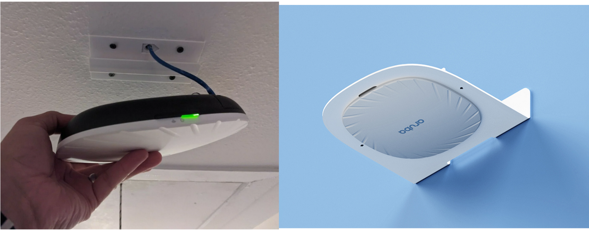

## What is an Access Point?

During the Summer of 2023, I was in charge of provisioning and installing the latest Access Points for the residents of UHM Housing. To clarify, Access Points, or AP for short, are basically boosters for the UHM wifi. Improving the connection of the school wifi with a certain area. You can actually see some scattered throughout the school and pretty much one in each classroom. They are usually hanging from the ceiling or mounted on walls. The images above show what these APs look like.

## What was I responsible for?

The APs that I was in charge of, needed to be installed in every UHM dorm, replacing the previously outdated model. That being said, in dorms like Frear Hall and the Aloha Towers, I was in charge of removing the previous APs and replacing them with new 535s for ALL UHM Housing. However, for one of the dorms, the Wainani buildings, I was also tasked to install the brackets that would be carrying said APs. From planning out where the bracket would be the most optimal to drilling in the brackets, I was pretty much responsible for revamping the UHM housing networking layout. 

## Working with a team

This experience did help me realize the amount of effort required to improve the connection of our school wifi. I worked alone during the first half of this project and I managed to finish two Aloha towers and most of Frear. However, after my supervisor began increasing the amount of people working on this project, it became a lot easier and we started to finish buildings a lot faster. Another thing that made me realize is how much of a difference it makes working with a team. I was able to split the work with my coworkers and we finished buildings twice as fast. All and all, working on this project helped me appreciate the amount of work and effort people put into providing better connections.
