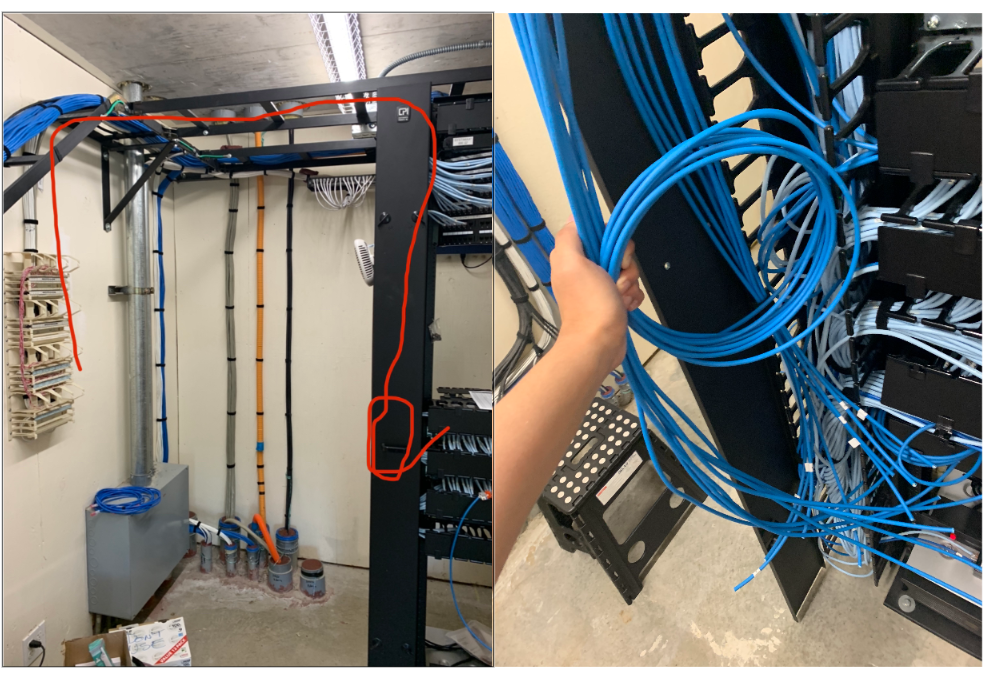
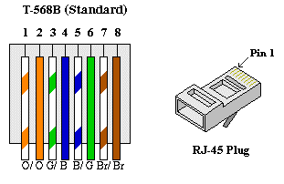

## Preparing for upcoming projects

One of my other projects that mention my work with installing new Access Points for UHM housing relates back to this project, as this is basically the prep work required for those APs to work. A task I was given before the summer of 2023, I was responsible for installing the new cabling that would connect and power the APs. To give some insight on this project, in order to have a functioning AP, it first needs to get power and in order to even provide the resident with an internet connection, it would first need to be connected to the switch. That’s where I come in. In the photos below, you can see the cables I was managing and you can see the path they needed to take in order to connect the APs to the switch.

## Making new cable

Although the only building I needed to make completely new cables from scratch was Frear Hall. That being said, this process was a tedious task, as I would first need to cut the right amount of cables with the correct length so the cables could reach both the switch, and the block that connects the APs. In addition, the cables that I was cutting didn’t have heads on them, so I was also tasked with punching in the wires to the block and punching in heads so that they can connect to the switch. Keep in mind that there are multiple closets in Frear Hall and they are technically separated by two parts Q and D side. I had to repeat the same process over and over. Below is the type of cabling I was making, where I would need to arrange the colored wires in a certain order and punch in a new head.

Even though this project took a lot of time, as I was the only one doing this project, it still provided me with a great experience. I got to witness the intricacies of networking and how much work is put into providing wired internet connection for large residential buildings. That there is cabling everywhere that gives us access to the internet. In addition, I learned that there is a process to massive projects and how these small and simple projects lead up to its completion.

