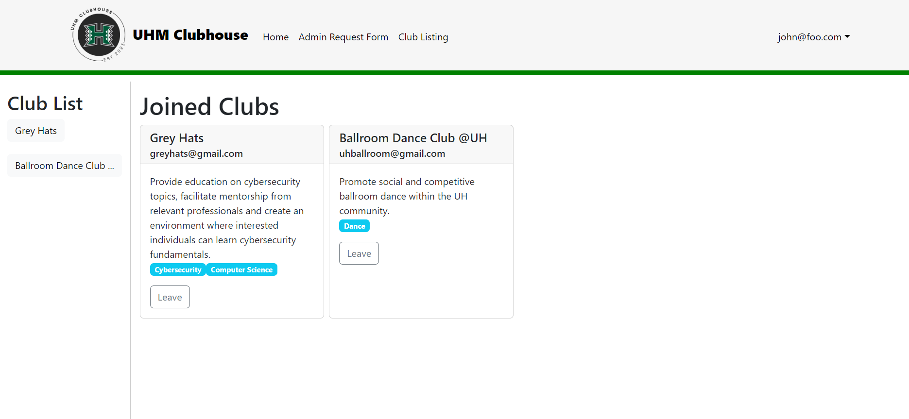

## Overview

  

[UHM Clubhouse](https://uhm-clubhouse.xyz/) is a web application with the intent of making the experience of finding and managing clubs within UH Manoa simple and easy. It was developed by me and five other members for our final project in ICS 314. The UHM Clubhouse’s main purpose is to provide students of UH Manoa with a website where they can look for a club that fits them. They will be able to sort through the vase database of clubs based on specific interests, or if they want to create their club, request for the admin role so they will be permitted to do so. Many components make up the UHM Clubhouse and each plays a role in making the experience of exploring the many clubs that UH Manoa offers.

## My Role and Contribution

When it came to developing UHM Clubhouse, it was decided as a group that everyone should work on separate components of the application and that if anyone needed help with their part, they could just communicate with the group. I decided to work on the part of the application in which users could save/join clubs that they were interested in. I created a separate collection that would store the joined clubs and made a join button for the club listing page. From there the collection would be displayed on the user landing page, where they can view their joined club and if they wanted to, leave when they are no longer interested in the club.

You can look further into detail on what my contributions were for this project, which was separated into three milestones:

[Milestone 1](https://github.com/orgs/uhm-clubhouse/projects/2)
[Milestone 2](https://github.com/orgs/uhm-clubhouse/projects/5)
[Milestone 3](https://github.com/orgs/uhm-clubhouse/projects/6)

  

## Lesson Learned

I gained many experiences working through this project and gave me a further understanding of the amount of effort that is put into these applications. Working with a team also made me acknowledge the concept of a team effort, where everyone needed to properly carry their own weight to prevent missing deadlines. Communication was key for this project as voicing out your choices and issues towards your group were crucial. I feel that these experiences helped me progress my development towards software development and gave me an insight into a work field with a team environment. Overall, I’m glad I got to take part in the development of this application and it was a pleasure working with my group members.

## Learn More

If you want to learn more about this project you can visit our project homepage [here](https://uhm-clubhouse.github.io/).
